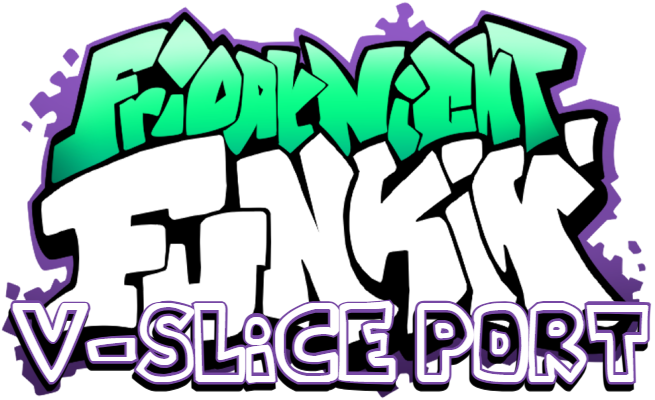

## Smoke 'Em Out Struggle V-Slice Port

**Smoke 'Em Out Struggle V-Slice Port** is a mod for the Friday Night Funkin' base game (Version 0.6.0+), that adds the original songs, and more.

### 🔥 Features:
- 🎬 Cutscenes & Dialogue
- 🕹️ Easy, Normal, and Hard difficulties
- 🧍 Custom Animations:
  - Nerves: Cough
  - Release: “Tight Bars”
  - Fading: Fade with smirk
- 🎵 Custom album covers
- 🎶 Extra songs (best experienced on **Hard** mode)
- 💬 Parity elements with FNF-v0.3.0+
- 🌟 NEW Pico mixes of your favorite tracks!

### 🎨 Credits:
- **kirbiro** / **Applehair** – Freeplay Icons  
- **Keynax** – Vocal Splitting  
- **Flezard** – Sprite fixes  
- **Plantgamer09** – Nerves (Pico Mix)  
- **Pink Lemonade** – Headache (Pico Mix)  
- **Comedy Lost** – Difficulty image fix

### ✅ Recommended Mods:
- [VS Annie OC Week V-Slice Port](https://gamebanana.com/mods/581764)

### 📦 Installation:
1. Drop `garcello v-slice.zip` into your base game's `mods` folder (create one if it doesn't exist).
2. Extraction is optional.

#### 🎭 For Alternate Icons:
- Extract the mod, then drop the `garcello v-slice` **icons folder** into the extracted `garcello v-slice` directory.

Enjoy the recreation of Smoke 'Em Out Struggle
